# Electrical Installation Design for HEPA & GREEN Buildings


# Overall Project Methodology

The electrical installation design was completed using a structured engineering workflow divided into four consecutive stages. Each stage builds upon the verified results of the previous stage, ensuring an organized, systematic, and standards-compliant design process. The complete methodology is presented in the following four flowcharts.

## Part 1 – Project Initiation and Indoor Lighting Design

The first part introduces the overall project workflow and covers **Progress 1**, which focuses on indoor lighting design. It begins with reviewing the project drawings, identifying the applicable engineering standards, and dividing the project into four stages. The lighting design is then carried out using the Lumen Method, including room area calculations, illuminance selection, Room Index (K), Coefficient of Utilization (CoU), Maintenance Factor (MF), luminaire selection, layout verification, and preparation of the lighting calculations and AutoCAD drawings.

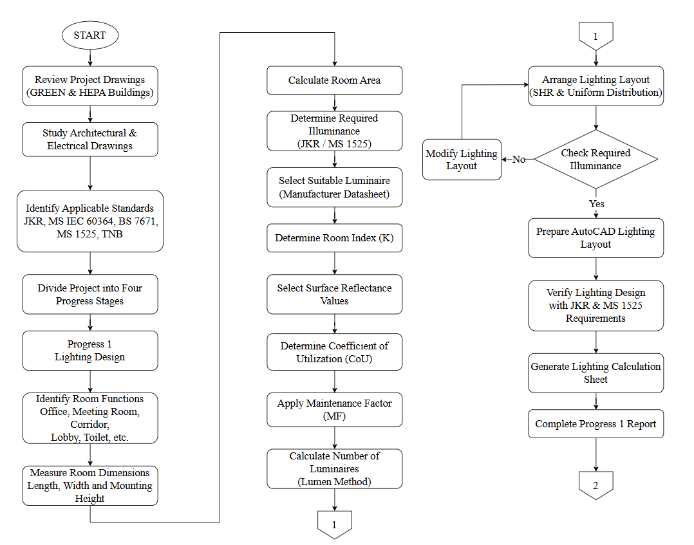

---

## Part 2 – Electrical Load Identification and Load Scheduling

The second part represents **Progress 2**, where all electrical loads within the HEPA Building and GREEN Building are identified and calculated. The process includes air-conditioning sizing, connected load calculations, Total Connected Load (TCL), Maximum Demand (MD), design current calculation, MCB selection, preliminary cable sizing, and preparation of the electrical load schedule. Finally, the electrical circuits are balanced across the three phases before completing the load calculations.

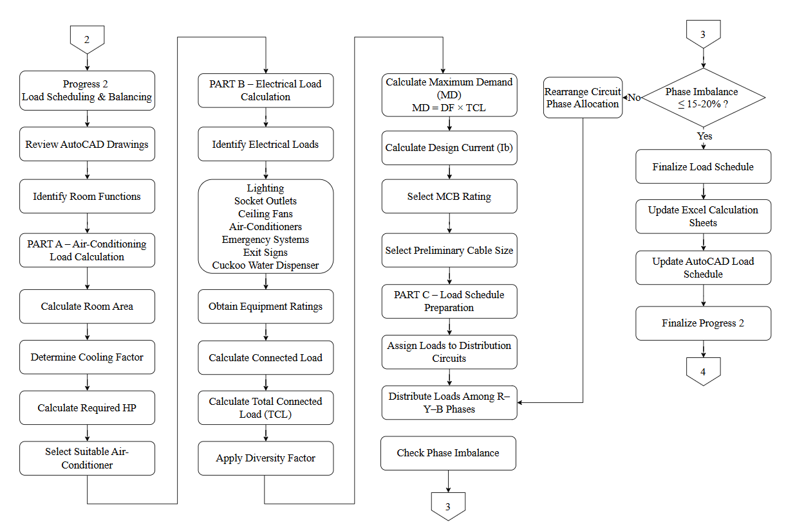

---

## Part 3 – Electrical Distribution System and Power Factor Correction

The third part corresponds to **Progress 3**, which develops the complete electrical distribution system. Distribution Boards (DB), Sub Switchboards (SSB), and the Main Switchboard (MSB) are designed using the calculated electrical loads. Protection coordination is verified by selecting suitable MCCBs, MCBs, RCCBs, and ELRs. The Power Factor Correction (PFC) system is then designed by calculating the required capacitor bank capacity, selecting capacitor stages, contactors, and protective devices before preparing the final electrical drawings.

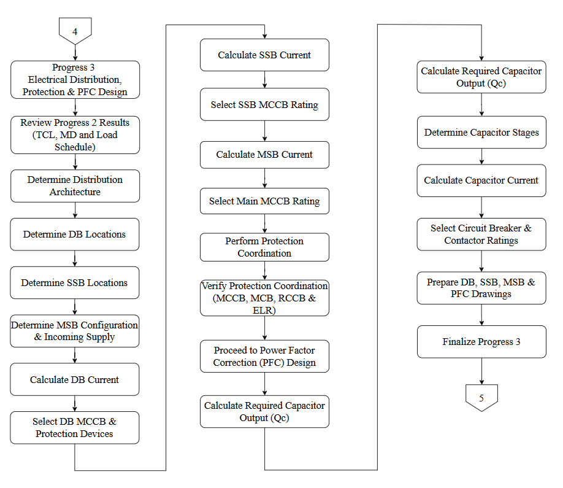

---

## Part 4 – Cable Sizing, Voltage Drop Analysis, and Final Documentation

The final part represents **Progress 4**, where suitable cable sizes are selected based on the design current and current-carrying capacity. Voltage drop calculations are performed for every feeder and final circuit to ensure compliance with BS 7671, MS IEC 60364, JKR, and TNB requirements. After verifying all engineering requirements, the calculation sheets are finalized and compiled into the complete project report.

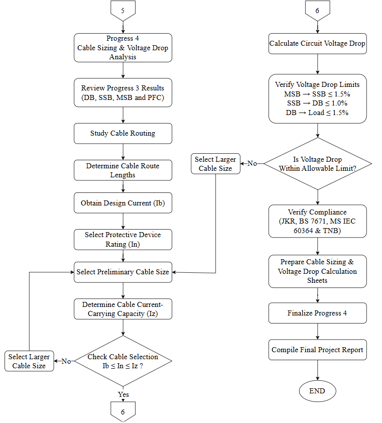

The completion of these four stages resulted in a complete low-voltage electrical installation design for the HEPA Building and GREEN Building, including engineering calculations, AutoCAD drawings, single-line diagrams, cable sizing, protection coordination, and supporting technical documentation.


## Overview

This repository presents the complete **Integrated Design Project 1 (IDP 1)** developed for the **Electrical Installation Design I (EMJ33404)** course at **Universiti Malaysia Perlis (UniMAP)**.

The project involves the complete design of a low-voltage electrical installation system for the **HEPA Building** and the **GREEN Building**. The work covers lighting design, electrical load estimation, electrical distribution system design, power factor correction, cable sizing, protection coordination, and engineering economic evaluation.

The project was completed through four progressive engineering stages, where the output of each stage became the input for the next. The final result is a complete electrical installation design supported by engineering calculations, AutoCAD drawings, single-line diagrams, and detailed technical documentation.

---

## Table of Contents

- [Overall Project Methodology](#overall-project-methodology)
- [Progress 1 – Indoor Lighting Design](#progress-1--indoor-lighting-design)
- [Progress 2 – Load Identification & Estimation](#progress-2--load-identification--estimation)
- [Progress 3 – Electrical Distribution System](#progress-3--electrical-distribution-system)
- [Progress 4 – Cable Sizing and Protection Design](#progress-4--cable-sizing-and-protection-design)
- [Final Deliverables](#final-deliverables)
- [Engineering Standards](#engineering-standards)
- [Software Used](#software-used)
- [Repository Structure](#repository-structure)
- [Team Members](#team-members)
- [Project Summary](#project-summary)
- [License](#license)

---

# Progress 1 – Indoor Lighting Design

The first stage of the project focused on designing an efficient indoor lighting system for both the HEPA Building and the GREEN Building. The objective was to provide adequate illumination for every room while ensuring energy efficiency, visual comfort, and compliance with Malaysian lighting standards.

The lighting design was carried out using the **Lumen Method**, which is one of the most widely used methods for indoor lighting calculations. Room dimensions, ceiling height, working plane height, and the required illuminance level were first determined from the architectural drawings and JKR lighting recommendations. Suitable luminaires were then selected based on their luminous flux and technical specifications.

The calculations included the Room Index (K), Coefficient of Utilization (CU), Maintenance Factor (MF), and the required number of luminaires for each room. After completing the calculations, lighting layouts were prepared using AutoCAD to ensure uniform light distribution throughout the buildings.

## Lighting Design Methodology

The following flowchart summarizes the complete workflow used during the indoor lighting design process.

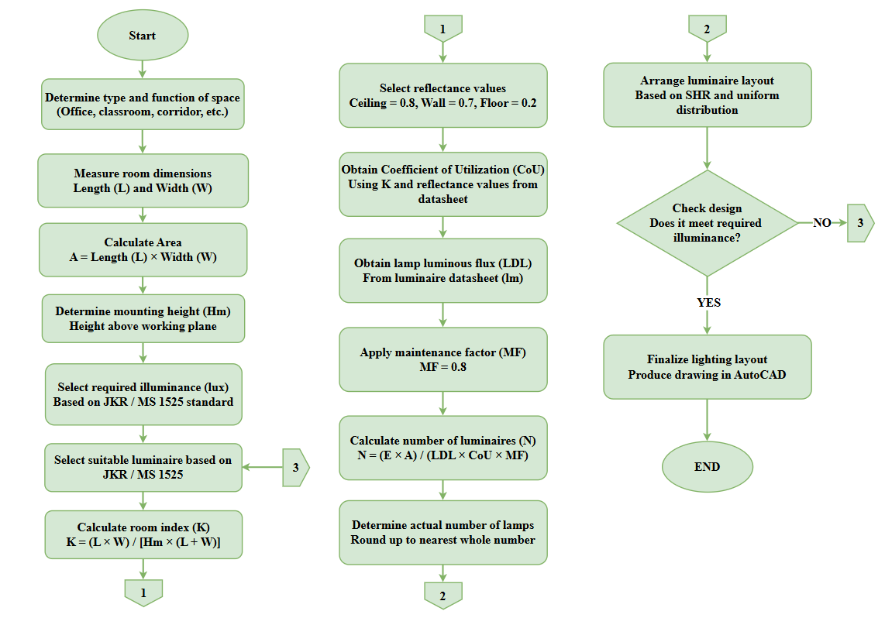

The lighting design process started by collecting the architectural drawings and identifying the function of each room. Room dimensions were measured to determine the floor area and the required illuminance level according to JKR and MS 1525 recommendations.

The Room Index (K) was then calculated to describe the geometry of each room. Based on the selected luminaire and room characteristics, the Coefficient of Utilization (CU) was obtained from the manufacturer's data. A suitable Maintenance Factor (MF) was also selected to account for lamp depreciation and dirt accumulation over time.

Using these parameters, the total luminous flux required for each room was calculated using the Lumen Method. The required number of luminaires was then determined and verified using the recommended Spacing-to-Height Ratio (SHR) to ensure uniform illumination without dark spots or excessive overlap.

Finally, the selected luminaires were arranged in AutoCAD according to the calculated spacing, producing the final lighting layouts for both buildings.

### Outputs of Progress 1

- Indoor lighting calculations using the Lumen Method.
- Room Index (K) calculations.
- Coefficient of Utilization (CU) selection.
- Maintenance Factor (MF) selection.
- Luminaire selection.
- Quantity of luminaires for every room.
- Lighting layout drawings using AutoCAD.
- Compliance with JKR and MS 1525 lighting requirements.

The completed lighting design provided the foundation for the next stage of the project, where all electrical loads within both buildings were identified and calculated.

---

# Progress 2 – Load Identification & Estimation

After completing the indoor lighting design, the second stage focused on identifying and calculating all electrical loads within the HEPA Building and the GREEN Building. The objective of this stage was to determine the Total Connected Load (TCL), Maximum Demand (MD), and electrical characteristics required for designing the distribution system in the next phase.

All electrical equipment installed in the buildings was identified from the architectural layouts and project requirements. These loads included lighting fixtures, socket outlets, ceiling fans, air-conditioning units, emergency lighting, exit signs, mechanical ventilation, and other electrical equipment. Every load was assigned to its corresponding electrical circuit before performing the required engineering calculations.

This stage also included air-conditioning sizing, load scheduling, circuit current calculations, MCB selection, cable sizing, and three-phase load balancing to ensure that the electrical distribution system would operate safely and efficiently.

## Air-Conditioning Sizing

The first activity in this stage was determining the cooling capacity required for every air-conditioned room. The room dimensions and cooling requirements were used to calculate the appropriate air-conditioning capacity before selecting the nearest standard unit.

The methodology used for the air-conditioning sizing process is shown below.

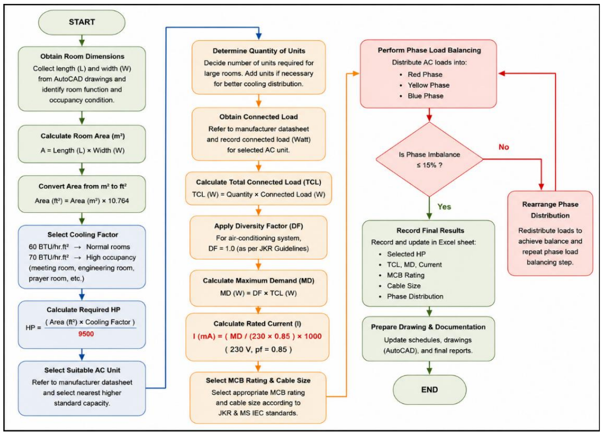

The process began by measuring the room dimensions to determine the floor area. A suitable cooling factor was then selected based on the room function and operating conditions. Using these values, the required cooling capacity was calculated and converted into horsepower (HP). Finally, the closest available commercial air-conditioning unit was selected to satisfy the calculated cooling requirement.

## Electrical Load Identification

After selecting the air-conditioning units, all electrical equipment within both buildings was identified and recorded. Each load was categorized according to its function before calculating the Total Connected Load (TCL) and Maximum Demand (MD).

The following flowchart illustrates the complete load identification procedure.

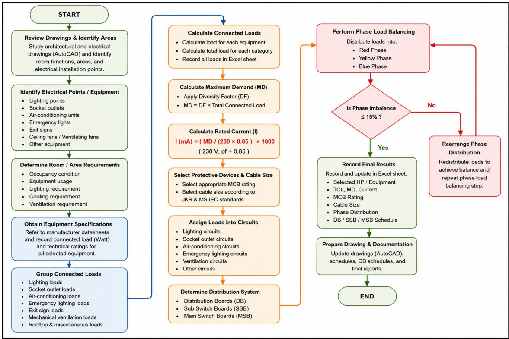

The process started by identifying every electrical load within each room. Lighting systems, socket outlets, ceiling fans, air-conditioning units, emergency lighting, exit signs, and special equipment were assigned to their respective circuits.

The connected power of every load was calculated and summarized in the load schedule. Diversity factors were then applied where appropriate to determine the Maximum Demand (MD). Based on the calculated demand current, suitable Miniature Circuit Breakers (MCBs) and preliminary cable sizes were selected for every circuit.

## Three-Phase Load Balancing

Once all electrical loads had been calculated, the circuits were distributed across the three supply phases to achieve the best possible load balance.

The load balancing methodology is illustrated below.

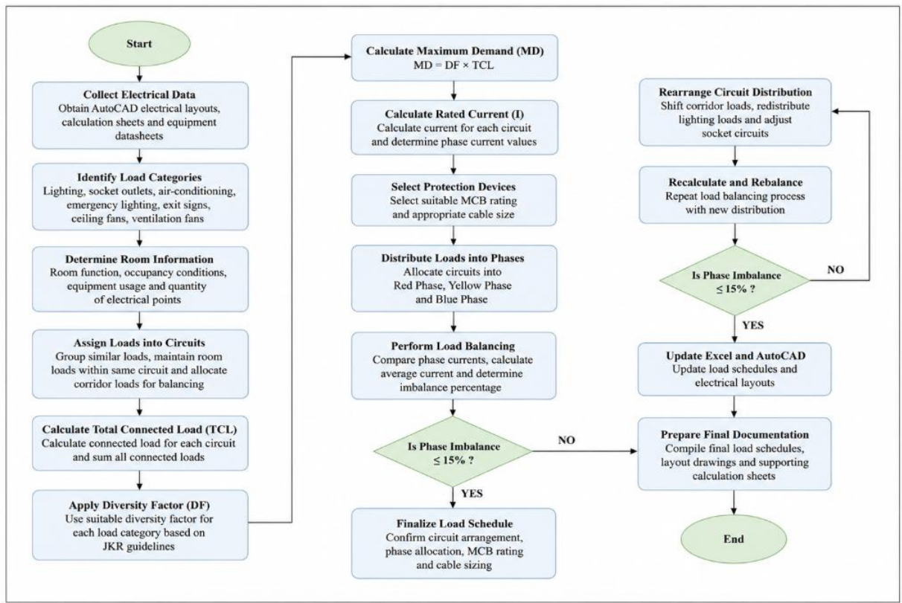

The total current on the Red, Yellow, and Blue phases was calculated and compared. Whenever the difference between phases exceeded the acceptable engineering limit, circuits were reassigned until a balanced distribution was achieved.

The final balanced load schedule included the Total Connected Load (TCL), Maximum Demand (MD), design current, protective device rating, cable size, and phase allocation for every electrical circuit. This balanced distribution minimizes neutral current, improves system stability, and provides a solid foundation for the electrical distribution system developed in the following stage.

### Outputs of Progress 2

- Air-conditioning sizing calculations.
- Electrical load schedules.
- Total Connected Load (TCL) calculations.
- Maximum Demand (MD) calculations.
- Circuit current calculations.
- Miniature Circuit Breaker (MCB) selection.
- Preliminary cable sizing.
- Three-phase load balancing.
- AutoCAD electrical load layouts.

The results obtained in this stage formed the basis for designing the Distribution Boards (DB), Sub Switchboards (SSB), Main Switchboard (MSB), and the complete electrical distribution network developed in Progress 3.

---

# Progress 3 – Electrical Distribution System

Following the completion of the electrical load calculations, the third stage focused on designing the complete electrical distribution system for both the HEPA Building and the GREEN Building. The objective of this stage was to develop a safe, reliable, and efficient power distribution network capable of supplying all electrical loads while complying with Malaysian electrical installation standards.

Using the Total Connected Load (TCL), Maximum Demand (MD), and balanced three-phase load schedules obtained in Progress 2, Distribution Boards (DB), Sub Switchboards (SSB), and the Main Switchboard (MSB) were designed. Appropriate protective devices were selected, and Power Factor Correction (PFC) was incorporated to improve the overall efficiency of the electrical installation.

## Electrical Distribution System Methodology

The complete electrical distribution system was developed using a systematic engineering approach. The methodology adopted throughout this stage is illustrated in the following flowchart.

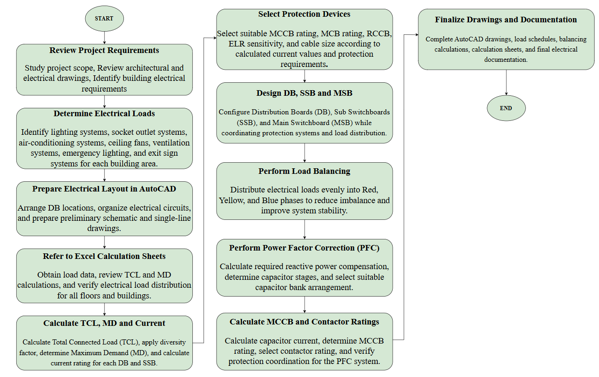

The design process started by reviewing the electrical load schedules and AutoCAD layouts prepared in the previous stage. The Total Connected Load (TCL), Maximum Demand (MD), and design current were verified before determining the electrical distribution hierarchy for both buildings.

Based on these calculations, electrical circuits were allocated to the appropriate Distribution Boards (DBs), which were then connected to their respective Sub Switchboards (SSBs). Finally, all SSBs were supplied from the Main Switchboard (MSB), forming the complete low-voltage electrical distribution network.

Throughout the design process, protection coordination, spare capacity, accessibility, and future expansion requirements were carefully considered to ensure a reliable and maintainable installation.

## Distribution Board, Sub Switchboard and Main Switchboard Design

After establishing the distribution hierarchy, detailed design calculations were carried out for every Distribution Board (DB), Sub Switchboard (SSB), and the Main Switchboard (MSB).

The following flowchart summarizes the complete design procedure.

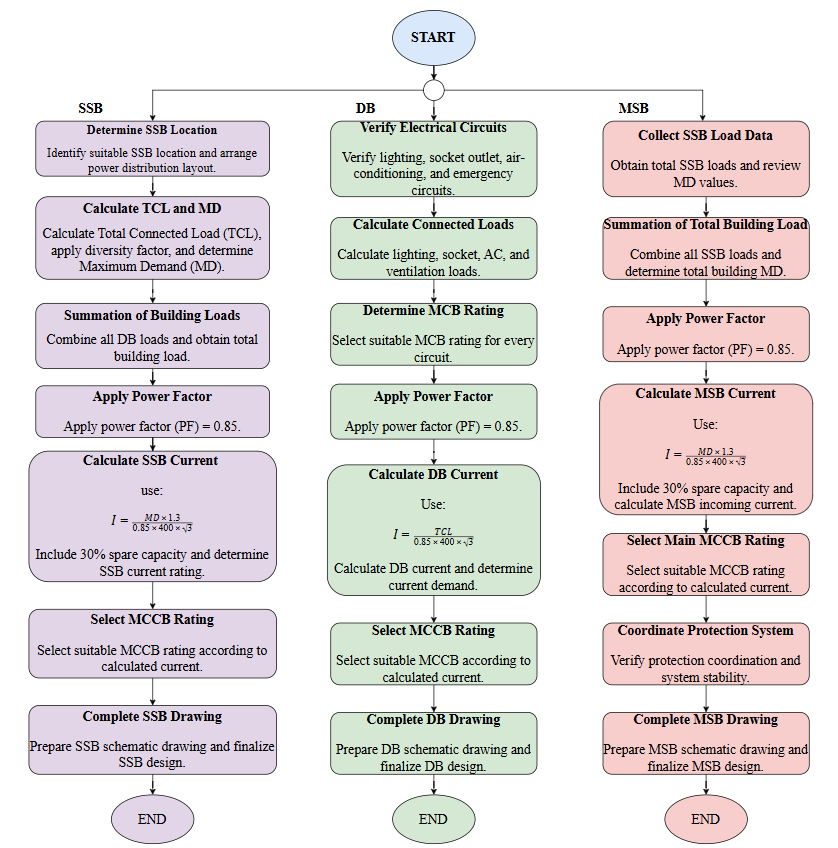

The design began by calculating the incoming current for each board using the Maximum Demand obtained from Progress 2. Suitable protective devices were then selected to satisfy the design current while maintaining compliance with BS 7671 requirements.

Each Distribution Board was designed with sufficient outgoing ways and spare capacity for future expansion. Similarly, the Sub Switchboards were sized according to the total demand of the connected Distribution Boards. The Main Switchboard was then designed to accommodate the entire electrical demand of both buildings while ensuring proper protection coordination between all upstream and downstream protective devices.

The completed design resulted in a well-organized electrical distribution network with improved operational reliability and simplified maintenance.

## Power Factor Correction (PFC)

The final activity of this stage was designing the Power Factor Correction (PFC) system to improve the power factor of the electrical installation and reduce unnecessary reactive power demand.

The methodology adopted for the PFC design is presented below.

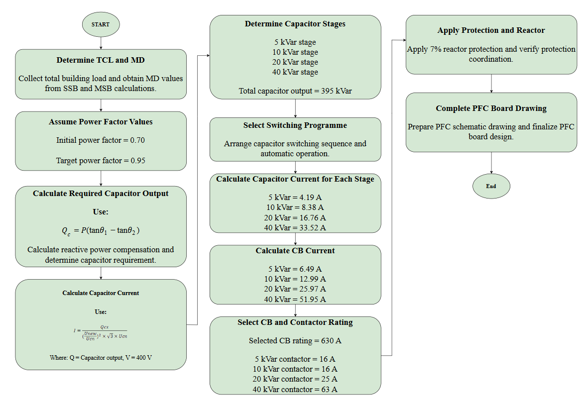

The existing power factor of the installation was first evaluated based on the calculated electrical loads. A target power factor was then selected in accordance with engineering practice and utility recommendations.

Using the calculated reactive power, the required capacitor bank size was determined. Suitable capacitor stages, switching arrangements, contactors, protective devices, and circuit breakers were then selected to ensure safe operation of the PFC system.

The completed PFC design improves energy efficiency, reduces current drawn from the supply, minimizes system losses, and enhances the overall performance of the electrical installation.

### Outputs of Progress 3

- Distribution Board (DB) design.
- Sub Switchboard (SSB) design.
- Main Switchboard (MSB) design.
- Single-line diagrams.
- Protective device selection.
- Protection coordination.
- Power Factor Correction (PFC) design.
- Capacitor bank sizing.
- Three-phase distribution verification.
- Complete electrical distribution layouts.

The electrical distribution system developed in this stage established the complete power delivery network for both buildings. The resulting design was then used in Progress 4 to perform cable sizing, voltage drop calculations, and final protection verification.

---

# Progress 4 – Cable Sizing and Protection Design

The fourth stage focused on selecting suitable cable sizes for the complete electrical installation and verifying that every cable satisfied the design current, protection requirements, and voltage drop limitations specified by Malaysian electrical installation standards.

Using the distribution system developed in Progress 3, each feeder and final circuit was analysed individually. Cable sizes were selected according to the design current, installation method, correction factors, and current-carrying capacity provided in BS 7671. Voltage drop calculations were then performed to ensure that every circuit operated within the allowable design limits.

This stage represents the final engineering verification before completing the overall electrical installation design.

## Cable Sizing Methodology

The cable sizing procedure followed throughout this project is illustrated in the flowchart below.

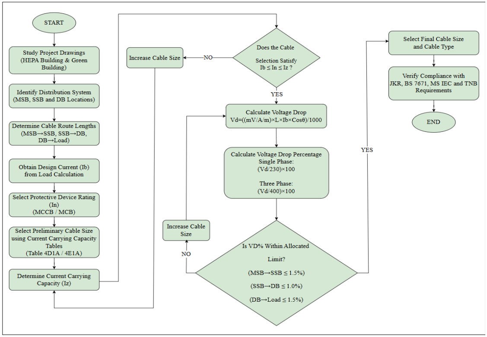

The design process began by reviewing the completed electrical distribution system developed during Progress 3. The feeder routes and final circuit lengths were measured from the AutoCAD drawings before calculating the design current for every circuit.

Appropriate cable types were selected based on the installation environment and project requirements. Correction factors such as ambient temperature, grouping factor, and installation method were applied where necessary to determine the effective current-carrying capacity of each cable.

The selected cable was then verified using the design condition:

- Design Current (Ib)
- Protective Device Rating (In)
- Cable Current-Carrying Capacity (Iz)

The selected cable was considered acceptable only when the following engineering requirement was satisfied:

**Ib ≤ In ≤ Iz**

If the selected cable did not satisfy this condition, a larger cable size was chosen and the verification process was repeated until all requirements were met.

After confirming the cable current-carrying capacity, voltage drop calculations were performed for every feeder and final circuit. The total voltage drop of the complete installation was limited to comply with BS 7671 recommendations by allocating:

- MSB to SSB: Maximum 1.5%
- SSB to DB: Maximum 1.0%
- DB to Final Circuit: Maximum 1.5%

This allocation ensured that the total voltage drop throughout the electrical installation remained below the allowable limit of 4%.

Finally, all selected cables were verified against the corresponding protective devices to ensure proper protection coordination, operational safety, and long-term reliability.

### Outputs of Progress 4

- Cable sizing calculations for all feeders and final circuits.
- Current-carrying capacity verification.
- Protective device coordination.
- Voltage drop calculations.
- Cable routing verification.
- Compliance with BS 7671 and MS IEC 60364.
- Final cable selection for the complete electrical installation.

The completion of this stage marked the end of the engineering design process. All calculations, drawings, and technical documentation from the four project stages were then integrated into the final project report, providing a complete low-voltage electrical installation design for the HEPA Building and the GREEN Building.

---

# Final Deliverables

The final submission integrates all engineering work completed throughout the four project stages into a single electrical installation design package. Every calculation, drawing, and technical document was reviewed and verified before being included in the final submission.

The final deliverables include:

- Final Project Report
- Complete AutoCAD Drawings
- Lighting Design Calculations
- Electrical Load Calculations
- Distribution System Calculations
- Cable Sizing Calculations
- Power Factor Correction (PFC) Calculations
- Distribution Board (DB) Single-Line Diagrams
- Sub Switchboard (SSB) Single-Line Diagrams
- Main Switchboard (MSB) Single-Line Diagram
- Supporting Excel Calculation Sheets

---

# Engineering Standards

The electrical installation was designed in accordance with the following engineering standards and guidelines:

- JKR Electrical Installation Guidelines
- MS IEC 60364 – Low-Voltage Electrical Installations
- BS 7671 – Requirements for Electrical Installations (18th Edition)
- MS 1525 – Energy Efficiency and Use of Renewable Energy for Non-Residential Buildings
- Suruhanjaya Tenaga (Energy Commission Malaysia)
- Tenaga Nasional Berhad (TNB) Requirements

Compliance with these standards ensured that the proposed electrical installation satisfies the required safety, reliability, efficiency, and engineering performance criteria.

---

# Software Used

The following software was used throughout the project:

| Software | Purpose |
|----------|---------|
| AutoCAD | Electrical layouts and single-line diagrams |
| Microsoft Excel | Engineering calculations and load schedules |
| Microsoft Word | Technical report preparation |

---

# Repository Structure

```text
IDP1-Electrical-Installation-Design/
│
├── README.md
├── LICENSE
│
├── Progress-1-Lighting-Design/
│   ├── README.md
│   ├── Lighting-Design-Flowchart.png
│   ├── IDP1-Progress-1-Lighting-Design-Report.pdf
│   └── IDP1-Progress-1-Quantity-Lamp-Calculation.xlsx
│
├── Progress-2-Load-Identification/
│   ├── README.md
│   ├── Air-Conditioning-Sizing-Flowchart.png
│   ├── Load-Identification-Flowchart.png
│   ├── Load-Balancing-Flowchart.png
│   ├── IDP1-Progress-2-GREEN-Building-Load-Calculation.xlsx
│   ├── IDP1-Progress-2-HEPA-Building-Load-Calculation.xlsx
│   ├── GREEN-Ground-Floor-Roof-Layout.dwg
│   ├── GREEN-Level-1-AC-Layout.dwg
│   ├── GREEN-Level-1-Lighting-Fan-Layout.dwg
│   ├── GREEN-Level-1-Power-Layout.dwg
│   ├── GREEN-Level-2-AC-Layout.dwg
│   ├── GREEN-Level-2-Lighting-Fan-Layout.dwg
│   ├── GREEN-Level-2-Power-Layout.dwg
│   ├── HEPA-Level-1-AC-Layout.dwg
│   ├── HEPA-Level-1-Lighting-Fan-Layout.dwg
│   ├── HEPA-Level-1-Power-Layout.dwg
│   ├── HEPA-Level-2-AC-Layout.dwg
│   ├── HEPA-Level-2-Lighting-Fan-Layout.dwg
│   ├── HEPA-Level-2-Power-Layout.dwg
│   ├── HEPA-Roof-Lighting-Fan-Layout.dwg
│   └── HEPA-Roof-Power-Layout.dwg
│
├── Progress-3-Distribution-System/
│   ├── README.md
│   ├── Distribution-System-Methodology.png
│   ├── DB-SSB-MSB-Design-Flowchart.png
│   ├── Power-Factor-Correction-Flowchart.png
│   ├── IDP1-Progress-3-Distribution-System-Report.pdf
│   ├── IDP1-Progress-3-GREEN-Building-Distribution-Calculation.xlsx
│   ├── IDP1-Progress-3-HEPA-Building-Level-1.xlsx
│   ├── IDP1-Progress-3-HEPA-Building-Level-2.xlsx
│   ├── IDP1-Progress-3-HEPA-Building-Level-2-and-PFC-Calculation.xlsx
│   ├── IDP1-Progress-3-HEPA-Building-and-MSB-Calculation.xlsx
│   ├── IDP1-Progress-3-Load-Summary.xlsx
│   ├── GREEN-First-Floor-Distribution-System.dwg
│   ├── GREEN-Ground-Floor-and-Roof-Distribution-System.dwg
│   ├── GREEN-Second-Floor-Distribution-System.dwg
│   ├── HEPA-Level-1-Distribution-System.dwg
│   ├── HEPA-Level-2-and-MSB-and-PFC-System.dwg
│   └── HEPA-Level-2-and-Roof-Distribution-System.dwg
│
├── Progress-4-Cable-Sizing-and-Protection/
│   ├── README.md
│   ├── Cable-Sizing-and-Voltage-Drop-Flowchart.png
│   ├── IDP1-Progress-4-Cable-Sizing-and-Protection-Report.pdf
│   ├── IDP1-Progress-4-GREEN-Building-First-Floor-Calculation.xlsx
│   ├── IDP1-Progress-4-GREEN-Building-Ground-Floor-Calculation.xlsx
│   ├── IDP1-Progress-4-GREEN-Building-Second-Floor-Calculation.xlsx
│   ├── IDP1-Progress-4-HEPA-Building-Level-1-Calculation.xlsx
│   ├── IDP1-Progress-4-HEPA-Building-Level-2-and-Roof-Calculation.xlsx
│   ├── GREEN-First-Floor-Cable-Routing.dwg
│   ├── GREEN-Ground-Floor-Cable-Routing.dwg
│   ├── GREEN-Second-Floor-Cable-Routing.dwg
│   ├── HEPA-Level-1-Cable-Routing.dwg
│   └── HEPA-Level-2-and-Roof-Cable-Routing.dwg
│
└── Final/
    ├── README.md
    ├── Overall-Project-Methodology.png
    ├── IDP1-Final-Report.pdf
    ├── IDP1-Project-Calculation.xlsx
    ├── IDP1-Lighting-Calculation.xlsx
    ├── IDP1-GREEN-Building-Load-Calculation.xlsx
    ├── IDP1-GREEN-Building-Distribution-System-Calculation.xlsx
    ├── IDP1-HEPA-Building-Load-Calculation.xlsx
    ├── IDP1-HEPA-Building-Level-1-and-MSB-Calculation.xlsx
    ├── IDP1-HEPA-Building-Level-2-and-PFC-Calculation.xlsx
    ├── GREEN-Building-Combined-Electrical-Layout.dwg
    ├── GREEN-Building-DB-and-SSB-Single-Line-Diagram.dwg
    ├── HEPA-Building-Combined-Electrical-Layout.dwg
    ├── HEPA-Building-DB-and-SSB-Single-Line-Diagram.dwg
    └── MSB-and-PFC-Board-Single-Line-Diagram.dwg
```

---

# Team Members

This project was completed by:

- Adel Husham Mohamedain Yousuf
- Waleed Abdullah Alwan Alfutaih
- Muaadh Mohammed Omar Bawazir
- Eltayeb Ibrahim Elnaim Ibrahim
- Al-Shaqdari Abdulrahman Khaled Qasem Ahmed

---

# Project Summary

This repository documents the complete design process of a low-voltage electrical installation system for the HEPA Building and the GREEN Building at Universiti Malaysia Perlis (UniMAP).

The project demonstrates a systematic engineering workflow, beginning with indoor lighting design and progressing through electrical load identification, distribution system design, power factor correction, cable sizing, voltage drop analysis, and protection coordination.

Each project stage is supported by detailed engineering calculations, AutoCAD drawings, Excel calculation sheets, and technical documentation prepared in accordance with Malaysian electrical engineering standards.

This repository serves as a comprehensive reference for students, researchers, and engineers interested in electrical installation design, building power distribution systems, and engineering documentation.

# License

This repository is released under the **MIT License**.

You are welcome to use this project for learning, academic reference, and educational purposes. If you reuse or modify any part of this work, appropriate attribution is appreciated.

For more information, see the `LICENSE` file included in this repository.
